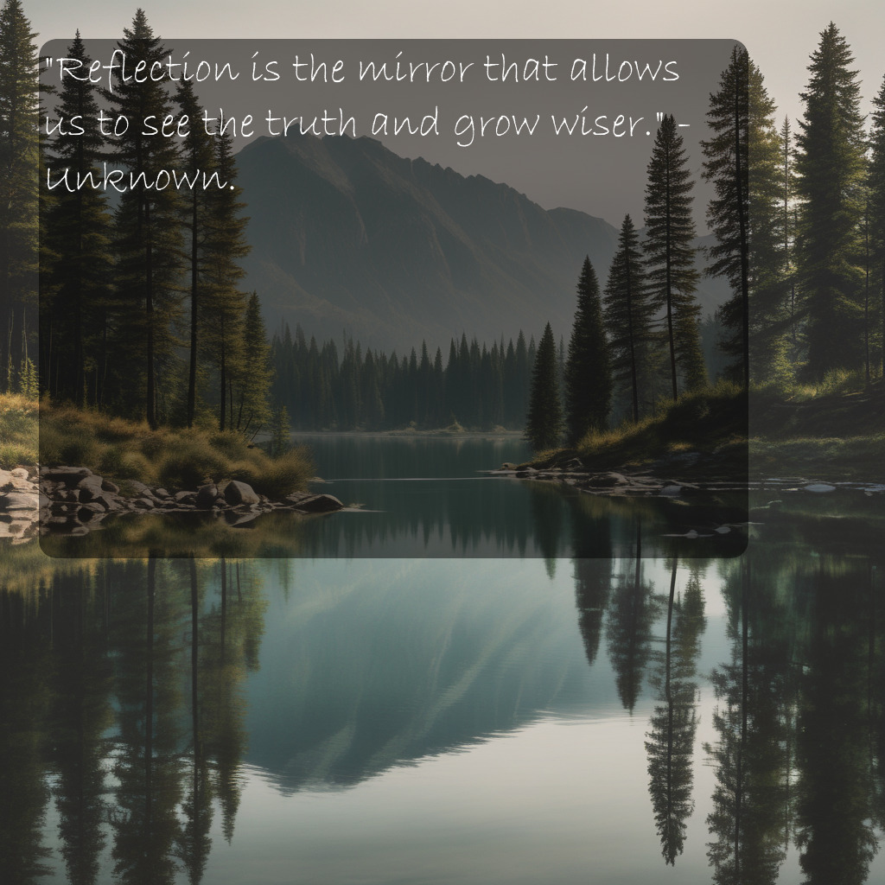

# Instagram Quote Generator
This program can be used to create inspirational quotes which are accompanied by matching images. The entire process is AI generated, from the creation of the quote to the prompt for the image generator.
 
**Please note that uploading AI generated content without human intervention is against Instagrams TOS**. This program shouldn't be used on an account which you do not want to get banned. This project is merely supposed to serve as an example of what can be done with AI systems.
 
## Setup
- Make sure that you have installed all of the necessary requirements onto your environment. (Hint. You can use the command "pip install -r requirements.txt)
- Type the command "python instacalming.py" into your terminal to start the program, it will output the quote as an image named "instacalming_output.jpg"
- **If you encounter an OOM (Out of Memory) error at any point in this process**, downgrade the models being used to something smaller (GGUF quantized models and smaller SDXL models)

